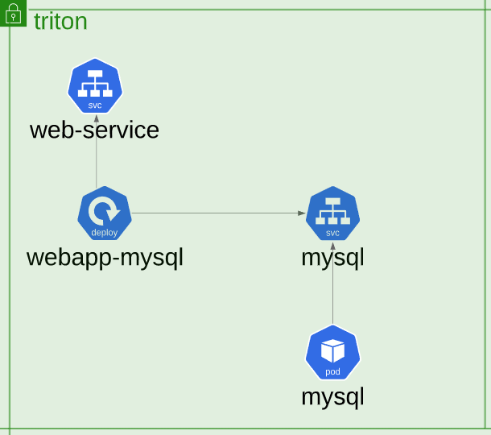

1. **Troubleshooting Test 1:** A simple 2 tier application is deployed in the triton namespace. It must display a green web page on success. Click on the app tab at the top of your terminal to view your application. It is currently failed. Troubleshoot and fix the issue.


    Stick to the given architecture. Use the same names and port numbers as given in the below architecture diagram. Feel free to edit, delete or recreate objects as necessary.

    - DB Service working?
    - WebApp Service working?

    

    `k config set-context --current --namespace=triton ; k get all`

    Do the services in triton namespace have a valid endpoint? If they do, check the kube-proxy and the weave logs.

    Does the cluster have a Network Addon installed?

    Install Weave using the link: https://kubernetes.io/docs/setup/production-environment/tools/kubeadm/create-cluster-kubeadm/#pod-network


    For example: `curl -L https://github.com/weaveworks/weave/releases/download/latest_release/weave-daemonset-k8s-1.11.yaml | kubectl apply -f -`

2. **Troubleshooting Test 2:** The same 2 tier application is having issues again. It must display a green web page on success. Click on the app tab at the top of your terminal to view your application. It is currently failed. Troubleshoot and fix the issue.

    The kube-proxy pod is not running. As a result the rules needed to allow connectivity to the services have not been created.

    Check the logs of the kube-proxy pod as follows: -
    ```
    # kube-proxy pod 
    kubectl -n kube-system logs <name_of_the_kube_proxy_pod>
    ```


    The configuration file /var/lib/kube-proxy/configuration.conf is not valid. The configuration path does not match the data in the ConfigMap.

    kubectl -n kube-system describe configmap kube-proxy shows that the file name used is config.conf which is mounted in the kube-proxy daemonset pod at the path /var/lib/kube-proxy/config.conf.


    However in the DaemonSet, for kube-proxy, the command used to start the kube-proxy pod makes use of the path /var/lib/kube-proxy/configuration.conf.

    Correct this path to /var/lib/kube-proxy/config.conf as per the ConfigMap and recreate the kube-proxy pod.

    Here is the snippet of the correct command to be run by the kube-proxy pod:

    ```
    spec:
        containers:
        - command:
            - /usr/local/bin/kube-proxy
            - --config=/var/lib/kube-proxy/config.conf
            - --hostname-override=$(NODE_NAME)
    ```


    This should get the kube-proxy pod back in a running state.


    Run the following command to check the kube-proxy pod status as follows: -


    ```
    kubectl get pods -n kube-system | grep kube-proxy
    kube-proxy-k845b                       1/1     Running   0          90s
    ```


    Note: - In your lab, the kube-proxy pod name could be different.
